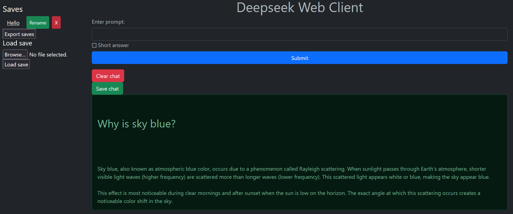

# Web-Chatbot

Simple web application that implements a locally running Deepseek model.

## Used technologies

- Ollama model implementation
- Deepseek r1:1.5b model
- Flask backend
- Bootstrap web design

## Functionality

Because of usage of the simplest r1 model the some more complex prompts don't get correct responses. For better performance a model with more parameters should be used. The lightest model was used there as an example.

Before showing the models response a basic html formatting is performed.

### Features

- Short / long responses (long ones also shows the models reasoning process that led him to the final answer)
- Saving a chat
- Loading a saved chat
- Deleting saved chat
- Renaming saved chat
- Exporting saves to an external json
- Uploading external json saves

## Notes
- Html formatting is very basic and some responses could have wrong formatting.
- Formulas and codes are not formatted.
- Ollama application has to be running with pulled corresponding model.
- Saves class is basically a dictionary with custom methods for saves (items) managing 
